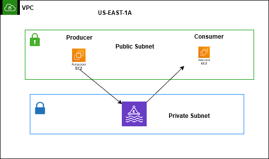
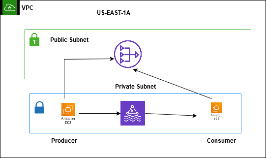

# AWS_MSK
# AWS_MSK
### Creating MSK Cluster in Private Subnet
Create an MSK cluster in provisioned mode with n standard/express brokers, each configured with nGB of storage per broker. Deploy the cluster across either 3 or 2 availability zones. Next, select the private subnet groups corresponding to the respective availability zones, assign the appropriate security groups, and choose the "unauthorized access control" method with plaintext encryption. Finally, proceed to create the cluster.
The cluster creation process typically takes around 15 minutes.

Deploying brokers across 2 or 3 availability zones ensures high availability and fault tolerance for the MSK cluster. 

### Launch an ec2 instance
Select the same availability zone as one of the MSK brokers for reduced latency if the EC2 instance will interact with the MSK cluster either in piblic subnet or private subnet.

### Security group creation 
Copy the security group of an ec2 instance and edit the inbound the rules of cluster security with ec2 security for limited access.

### Install the kafta on EC2 Client
Go the [shell_script.sh](shell_script.sh)
Now follow the same steps for consumer ignore the topic creation and starting a producer lines(i.e; line 6 and 7)
### Network
If Ec2 is in public subnet and msk in private just add necessary security groups.(Like msk broker security groups should allow trafiic from from ec2) 
Below diagram shows vpc connections 

If ec2 is deployed in private subnet deploy nat gateway inj public subnet so that ec2 instances can use the internet to download necessary packages

